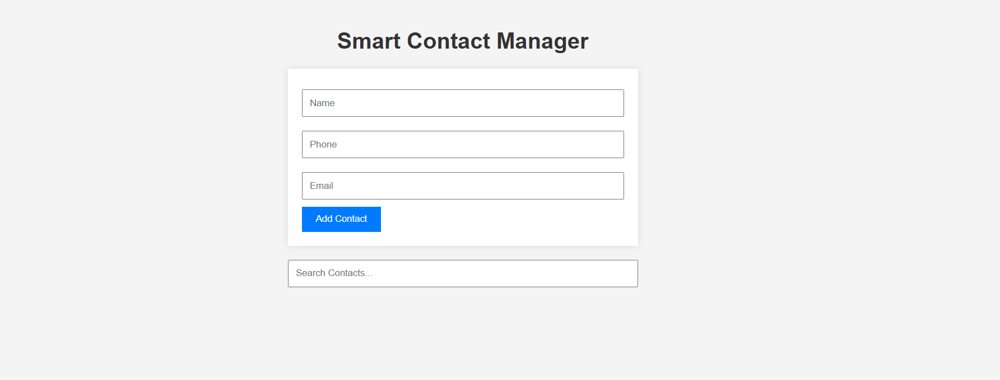

# Smart Contact Manager

A responsive web app to manage personal contacts with features like add, edit, delete, and search. Built with HTML, CSS, and JavaScript, and uses `localStorage` for persistent data.

## 🚀 Live Demo
👉 [Click here to view the live project](https://smartcontactmanager123.netlify.app)

## 🛠 Tech Stack
- HTML5
- CSS3
- Vanilla JavaScript
- localStorage API

## 📦 Features
- Add new contacts (name, phone, email)
- View all contacts
- Edit and delete existing contacts
- Real-time search/filter
- Data saved in browser’s localStorage
- Responsive design (mobile-friendly)

## 📸 Screenshot


## 📁 Getting Started
1. Clone the repo:
   ```bash
   git clone https://github.com/AkashReddy1001/smart-contact-manager.git
